# JavaScript

## Introductie

Programmeren volgens strikte richtlijnen heeft een aantal voordelen:

- de code is leesbaar voor elk teamlid;
- daardoor wordt de code ook beter onderhoudbaar;
- en geeft de volledige code een professionele indruk;

## Voertaal

Programmeren doe je vaak in een internationaal team. Daarom kiezen we voor
Engels als voertaal in je broncode. Dit betekent dat je alle benamingen (van
klassen, variabelen, methodes, properties, enz.) en ook je commentaar in je
code in het Engels schrijft.

## Conventies

Om consistentie in de code te garanderen, volgen we de [Airbnb JavaScript Style Guide](https://github.com/airbnb/javascript). Gebruik deze style guide als referentie voor het schrijven van JavaScript-code.

1. [Types](https://github.com/airbnb/javascript#types)
1. [References](https://github.com/airbnb/javascript#references)
1. [Objects](https://github.com/airbnb/javascript#objects)
1. [Arrays](https://github.com/airbnb/javascript#arrays)
1. [Destructuring](https://github.com/airbnb/javascript#destructuring)
1. [Strings](https://github.com/airbnb/javascript#strings)
1. [Functions](https://github.com/airbnb/javascript#functions)
1. [Arrow Functions](https://github.com/airbnb/javascript#arrow-functions)
1. [Classes & Constructors](https://github.com/airbnb/javascript#classes--constructors)
1. [Modules](https://github.com/airbnb/javascript#modules)
1. [Iterators and Generators](https://github.com/airbnb/javascript#iterators-and-generators)
1. [Properties](https://github.com/airbnb/javascript#properties)
1. [Variables](https://github.com/airbnb/javascript#variables)
1. [Hoisting](https://github.com/airbnb/javascript#hoisting)
1. [Comparison Operators & Equality](https://github.com/airbnb/javascript#comparison-operators--equality)
1. [Blocks](https://github.com/airbnb/javascript#blocks)
1. [Control Statements](https://github.com/airbnb/javascript#control-statements)
1. [Comments](https://github.com/airbnb/javascript#comments)
1. [Whitespace](https://github.com/airbnb/javascript#whitespace)
1. [Commas](https://github.com/airbnb/javascript#commas)
1. [Semicolons](https://github.com/airbnb/javascript#semicolons)
1. [Type Casting & Coercion](https://github.com/airbnb/javascript#type-casting--coercion)
1. [Naming Conventions](https://github.com/airbnb/javascript#naming-conventions)
1. [Accessors](https://github.com/airbnb/javascript#accessors)
1. [Events](https://github.com/airbnb/javascript#events)

## Configuratie IDE

We gebruiken [ESLint](https://eslint.org/) om de code te controleren op fouten en om de code te formatteren. De configuratie van ESLint is gebaseerd op de style guide.

### ESLint-configuratie

Indien je nog geen NPM-project hebt, maak dan een nieuw project aan.

```sh
npm init -y
```

Installeer ESLint met de Airbnb Style Guide-regels.

```sh
npx install-peerdeps --dev eslint-config-airbnb-base
```

Dit zal de volgende packages installeren:

- `eslint`
- `eslint-config-airbnb-base`
- `eslint-plugin-import`

Maak een `.eslintrc.json`-bestand aan in de root van je project.

```json
{
  "extends": "airbnb-base"
}
```

Let op: indien je gebruik maakt van Git, voeg dan een `.gitignore`-bestand toe in de root van je project om de `node_modules`-map te negeren.

```sh
node_modules/
```

### Webstorm

Webstorm heeft een ingebouwde ESLint-plugin.

Ga naar `Help` > `Find Action...` en zoek naar `Actions on Save`.

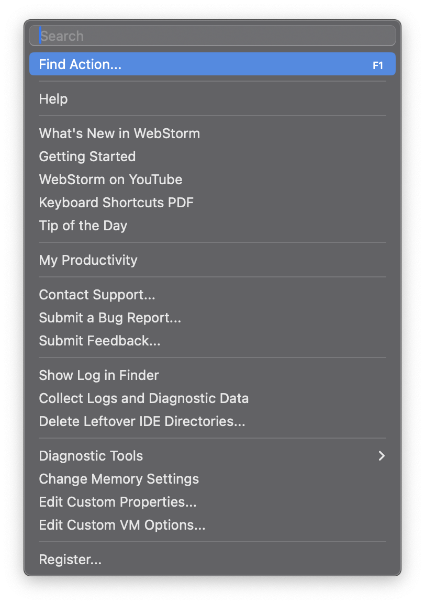

Vink `Run eslint --fix` aan.

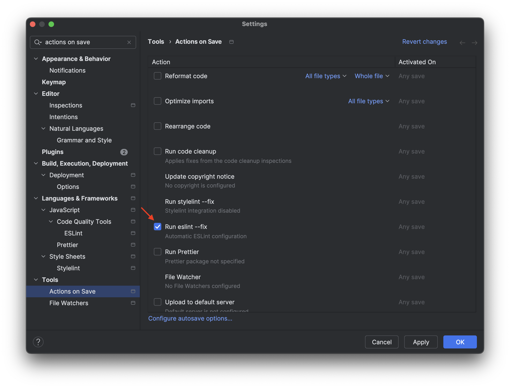

### Visual Studio Code

Installeer de [ESLint-plugin](https://marketplace.visualstudio.com/items?itemName=dbaeumer.vscode-eslint) in Visual Studio Code.

Ga naar `Help` > `Show all commands` en zoek naar `Settings`.
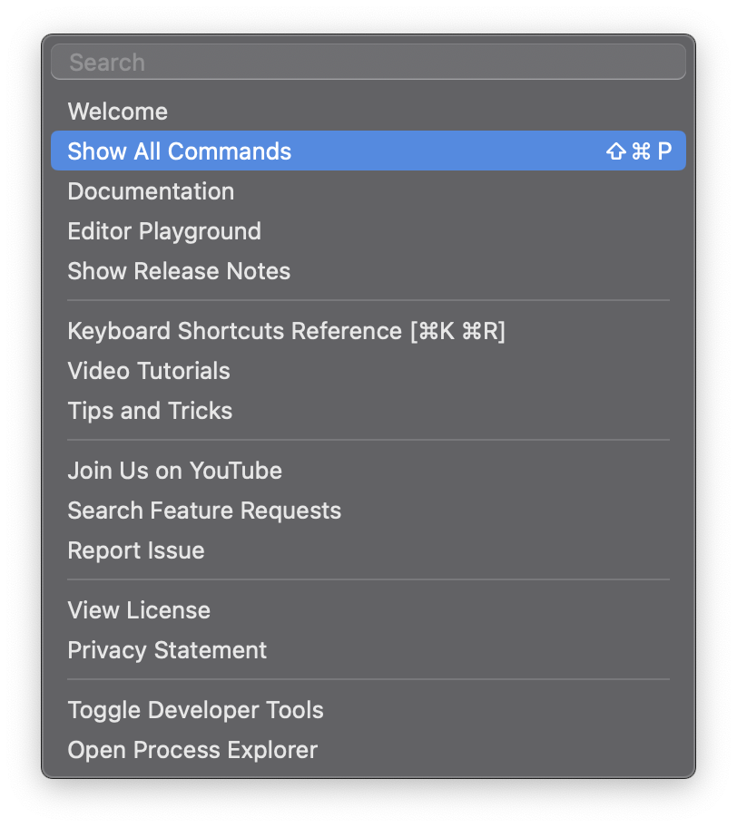

Klik `Preferences: Open Settings (UI)` aan om de settings te openen.
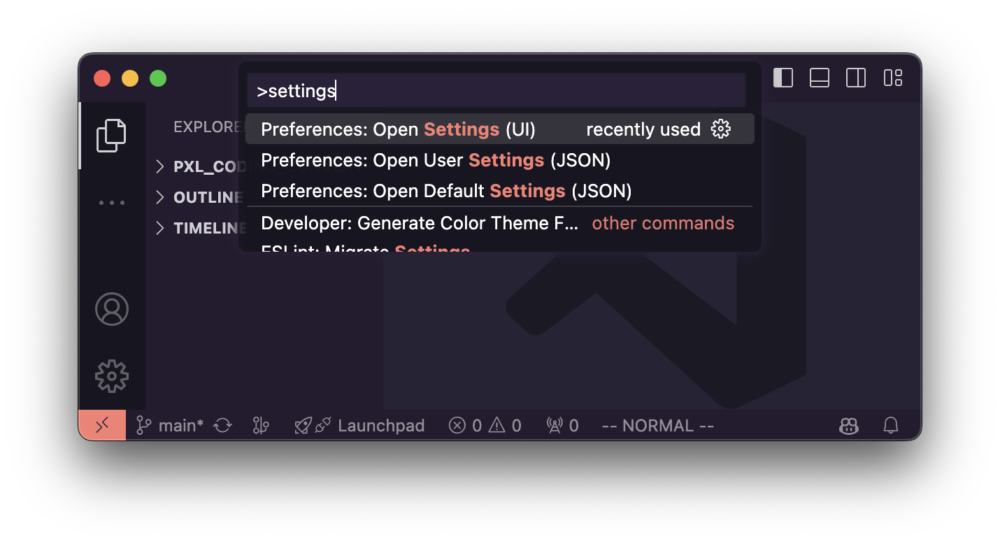

Zoek hier naar `eslint` en vink `Enables ESLint as a formatter` aan.

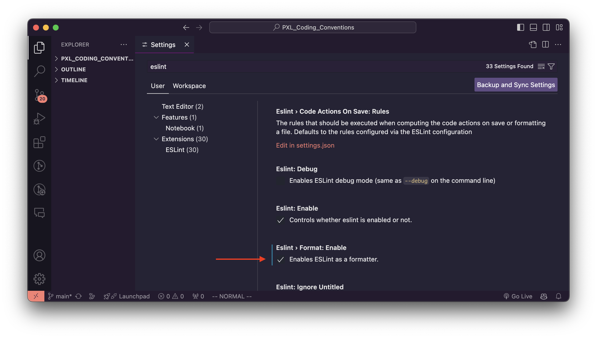

Zoek hier naar `format on save` en vink `Format On Save` aan.

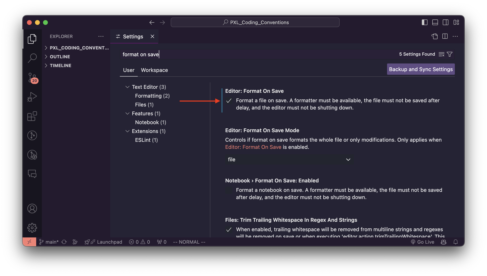

ESLint aanduiden als default formatter.

Ga naar `Help` > `Show all commands` en zoek naar `Format Document`, selecteer `Format Document With...` en kies `Configure Default Formatter...`, kies vervolgens `ESLint`.

Wanneer opnieuw gekeken wordt naar `Format Document With...`, zal `ESLint` nu de default formatter zijn.

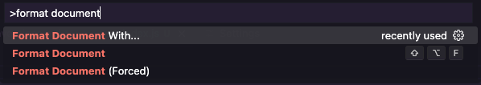
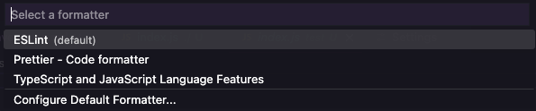

Zie je de optie niet? Herstart Visual Studio Code.

Bevestigen dat het werkt. Maak een nieuwe JavaScript-file aan en schrijf een stukje code dat niet voldoet aan de style guide.

<code>
  <pre>
function testFunction() 
{
        console.log('test');
}</pre>
</code>

Er worden nu rode lijnen getoond in de editor. Wanneer je hier over gaat met de muis, dan krijg je informatie over welke regel niet voldoet aan de style guide.

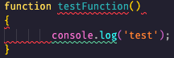
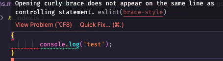
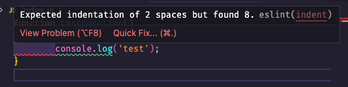
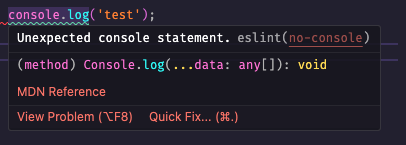
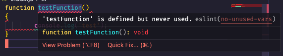
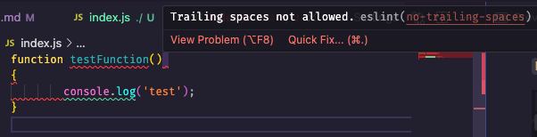

Wanneer `Format on Save` is aangevinkt, dan zal de code automatisch aangepast worden wanneer je de file opslaat.

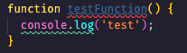

Merk op dat de functie nog altijd ongebruikt is. En dat de console.log nog altijd in de code staat. Veel wordt automatisch opgelost, maar niet alles.